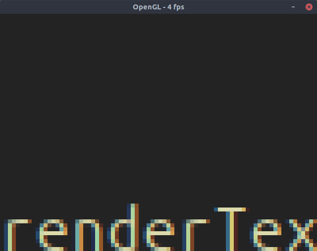
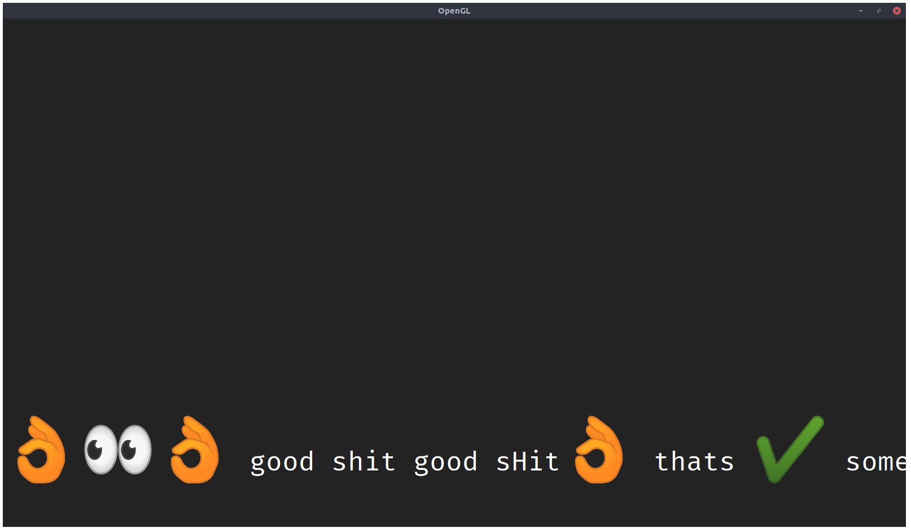
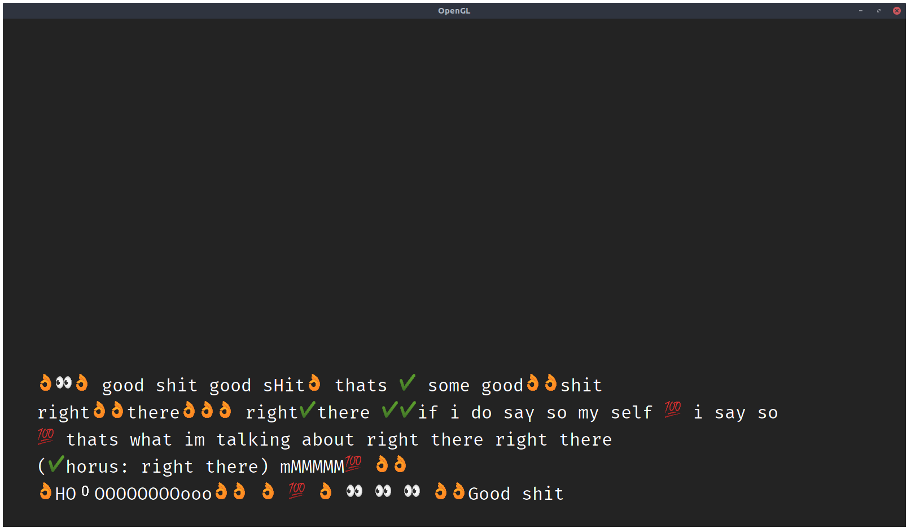
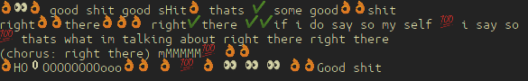
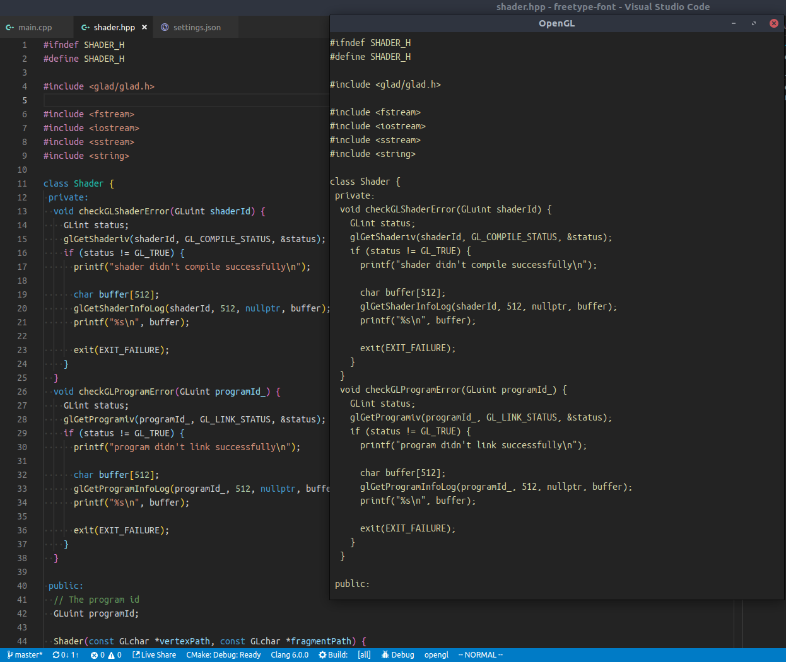
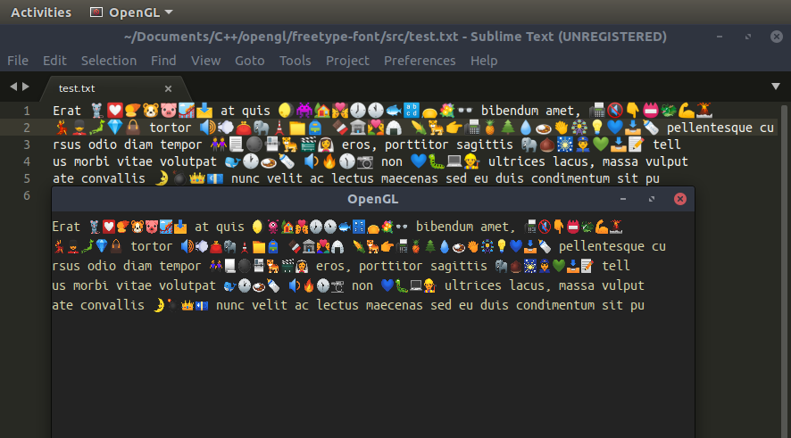

## Development

```shell
git clone https://github.com/mrandri19/freetype-opengl-experiments

cd freetype-opengl-experiments

mkdir build

cd build

cmake -G Ninja .. 

cd ..

ninja -C build

./build/opengl README.md
```

## Screenshots

The first text rendered with LCD Subpixel rendering.


The first emojis rendered.


The first paragraph of emojis rendered.


Emojis rendered with incorrect gamma blending.


Emojis rendered with correct gamma blending.


Side by side comparison with VSCode


Side by side comparison with Sublime Text 3

